# Automotive Radar Signal Simulation & Deep Learning-Based Interference Mitigation

[](https://github.com/veyo-git/automotive-radar-dl/actions)
[](https://www.python.org/)
[](LICENSE)

**FMCW Radar Physics Simulation + CNN Interference Classification + U-Net Denoising**

An end-to-end system for simulating automotive FMCW radar signals, injecting realistic mutual interference, classifying interference types with deep learning, and recovering clean Range-Doppler maps via U-Net-based denoising.

> **中文文档**: [README_CN.md](README_CN.md)

---

## Why This Matters

Modern vehicles carry 5-8 radar sensors operating in the 76-81 GHz band. As autonomous driving adoption accelerates, **radar-to-radar mutual interference** has become a critical safety issue:

- Mutual interference can reduce **detection probability from >95% to <30%** in worst cases
- ETSI and FCC are developing interference mitigation requirements for automotive radar certification
- Tier-1 suppliers (Bosch, Continental) and OEMs (BYD, NIO, Tesla) are actively hiring for radar + ML roles

This project simulates these interference scenarios and demonstrates that **deep learning can recover >85% of lost detection performance** — a 12+ dB SINR improvement without hardware modifications.

---

## Architecture

```mermaid
graph TB
    subgraph Simulator["FMCW Radar Simulator"]
        A[Chirp Generator] --> B[Multi-Target RX]
        B --> C[Mixer + LPF]
        C --> D[ADC Sampling]
        D --> E[2D FFT Processing]
        E --> F[CA-CFAR Detection]
    end

    subgraph Interference["Interference Injection"]
        G[CW] --> L[INR Control]
        H[Cross-FMCW] --> L
        I[Noise] --> L
        J[Spoofing] --> L
        K[Chirp-Swept] --> L
        L --> M[Interfered RD Map]
    end

    F --> M
    M --> N[CNN Classifier]
    M --> O[U-Net Denoiser]
    N --> P[Interference Type]
    O --> Q[Clean RD Map]
    Q --> R[SINR Evaluation]

    style Simulator fill:#1a1a2e,stroke:#e94560
    style Interference fill:#1a1a2e,stroke:#f39c12
```



---

## Quick Start

```bash
# Clone
git clone https://github.com/veyo-git/automotive-radar-dl.git
cd automotive-radar-dl

# Install
pip install -e .

# Generate dataset (quick test)
python scripts/generate_dataset.py --n_samples 2000 --rd_size 64

# Train models
python src/training/train_classifier.py --epochs 50
python src/training/train_denoiser.py --epochs 80

# Evaluate
python src/eval/benchmark.py --classifier models/classifier.pth --denoiser models/denoiser.pth

# Launch interactive demo
python src/viz/app.py
```

### One-Click Reproduce

```bash
python scripts/reproduce_all.py --n_samples 12000 --seed 42
```

This single command generates the dataset, trains both models, and runs the full benchmark.

---

## Results Summary

| Interference Type | Classification Accuracy | SINR Improvement | Pd Recovery |
|-------------------|------------------------|------------------|--------------|
| CW Interference | 98.2% | +14.3 dB | 0.28 → 0.91 |
| Cross-FMCW | 94.7% | +11.2 dB | 0.22 → 0.87 |
| Noise Jamming | 96.1% | +15.8 dB | 0.31 → 0.93 |
| Spoofing | 91.5% | +10.5 dB | 0.19 → 0.85 |
| Chirp-Swept | 93.3% | +12.1 dB | 0.25 → 0.89 |
| **Overall** | **94.8%** | **+12.8 dB** | **+0.61** |

*Dataset: 12,000 auto-generated Range-Doppler maps (128×128). Tested on held-out 1,200 samples.*
*Inference speed: 8.3 ms/frame (RTX 3060), 47 ms/frame (i7-12700H CPU)*

---

## Project Structure

```
automotive-radar-dl/
├── src/
│   ├── simulator/         # FMCW radar physics engine
│   │   ├── waveform.py    # Chirp generation, IF mixing, ADC
│   │   ├── target.py      # Multi-target model (range, velocity, RCS)
│   │   ├── processing.py  # 2D FFT, CA-CFAR, OS-CFAR detection
│   │   └── interference.py # 5 interference types + INR injection
│   ├── models/            # Deep learning models
│   │   ├── classifier.py  # 2D CNN for interference classification
│   │   ├── denoiser.py    # U-Net for RD map denoising
│   │   └── dataset.py     # HDF5 PyTorch Dataset + DataLoader
│   ├── training/          # Training scripts
│   │   ├── config.py      # Hyperparameters & preset configs
│   │   ├── train_classifier.py
│   │   └── train_denoiser.py
│   ├── eval/              # Evaluation
│   │   ├── metrics.py     # SINR, Pd, Pfa, confusion matrix
│   │   └── benchmark.py   # Full evaluation pipeline
│   └── viz/               # Visualization
│       ├── plots.py       # Matplotlib publication plots
│       └── app.py         # Gradio interactive dashboard
├── scripts/
│   ├── generate_dataset.py  # Synthetic data generation
│   └── reproduce_all.py     # One-click experiment reproduction
├── notebooks/             # Jupyter tutorials
├── tests/                 # Unit tests (37 tests)
├── .github/workflows/     # CI/CD
└── docs/                  # Extended documentation
```

---

## Key Features

- **Physics-accurate FMCW simulation**: 77 GHz carrier, configurable bandwidth/chirp parameters, Range-Doppler 2D FFT processing chain, CA-CFAR and OS-CFAR detection
- **5 realistic interference types**: Continuous Wave, Cross-FMCW (mutual interference), Noise Jamming, Spoofing, and Chirp-Swept interference
- **2D CNN classifier**: Lightweight design (~1.8M params), achieves >94% accuracy on 6-class interference classification
- **U-Net denoiser**: Skip-connection architecture with gradient-aware loss, progressive curriculum training
- **Comprehensive metrics**: SINR improvement, Pd/Pfa recovery, per-class accuracy, confusion matrix
- **Interactive demo**: Gradio dashboard with real-time RD map generation, classification, and denoising
- **Reproducible**: Single command to regenerate all results with fixed random seeds

---

## Radar Configurations

Default parameters match the **TI AWR1843 Boost** automotive radar:

| Parameter | Value | Description |
|-----------|-------|-------------|
| Carrier frequency | 77 GHz | 76-81 GHz automotive band |
| Bandwidth | 750 MHz | 0.2 m range resolution |
| Chirp duration | 40 µs | Fast chirp for high update rate |
| Chirps per frame | 64 | Doppler resolution |
| ADC sample rate | 10 MSPS | Complex I/Q sampling |
| Max range | ~200 m | Unambiguous range |
| Max velocity | ±30 m/s | Radial velocity |

---

## Requirements

- Python 3.10+
- PyTorch 2.0+ (GPU recommended but not required)
- NumPy, SciPy, Matplotlib, h5py
- Gradio (for demo dashboard)

```bash
pip install -r requirements.txt
```

---

## Contributing

Contributions are welcome! Please see [CONTRIBUTING.md](CONTRIBUTING.md) for guidelines.

---

## License

MIT License. See [LICENSE](LICENSE) for details.

---

## Author

With a background in complex electromagnetic environment analysis, I built this project to bridge EM domain expertise with modern deep learning — tackling one of the key challenges in autonomous driving sensor fusion.
